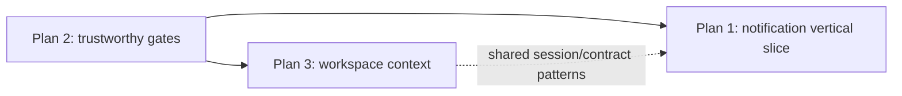

# CadenceLMS — Top Three Success Priorities

> **Status:** Coordinator implementation plan
>
> **Date:** 2026-07-20
>
> **Scope:** CadenceLMS project, coordinated through the `cadencelms` orchestrator
> instance. This document is an execution plan for workers and gate owners; it is
> not authorization for the orch-manager to modify product code.

## Executive priority order

The current orchestrator state shows 57 issues in progress, 9 blocked, 3 failed,
and 3 off-rails, with fleet focus at approximately 95.7%. The highest-value
work is therefore to finish three coherent paths rather than add more parallel
scope:

1. **Make notifications real end to end.** The application has notification
   models, routes, preferences, and UI scaffolding, but the event-to-delivery
   path is incomplete.
2. **Make verification and release gates trustworthy.** Contract export,
   contract ingestion, JUnit reporting, timeouts, and CI enforcement currently
   create false negatives or leave drift undetected.
3. **Make workspace selection real and authorization-safe.** Replace the
   hardcoded workspace selector with persisted multi-workspace session context.

The plans below use the orchestrator's issue, goal, contract, and gate records as
the source of truth. Every implementation follows the normal sequence:

```text
contract/ADR review → issue branch from current main → implementation
→ report_work → verify_run → gate_decision → completion/promotion
```

Workers must not merge or push. The orchestrator owns verification, promotion,
and issue-state transitions.

---

## Plan 1 — Complete the notification vertical slice

### Outcome

Prove this user-visible behavior in pseudo-prod:

```text
enrollment or grade event
  → domain event
  → notification producer
  → Notification record
  → dispatch worker
  → in-app notification + captured email
  → feed/unread state
  → mark read
  → notification journey test passes
```

After the first vertical slice is green, add the remaining event producers and
digest behavior without changing the delivery contract.

### Current orchestrator evidence

- Goal #8, `P1-BE-2`, is paused.
- Goal #9, `P1-FE-1`, is paused pending agreed notification contracts.
- #33 is off-rails; its children #43 and #44 are active.
- #34, the enrollment notification producer, is active.
- #35 is off-rails; #45 owns the dev-capture transport and #58 now owns the
  dispatch worker.
- #36, the digest job, is active.
- #37, notification contract extensions, is active.
- #38 is off-rails; #46, #47, and #48 are active frontend children.
- #39, #40, #41, and #42 are active frontend work.
- Proposed notification contracts currently conflict with live routes:
  `GET /users/me/notifications` versus `GET /notifications`, and
  `POST /users/me/notifications/mark-all-read` versus
  `POST /notifications/read-all`.
- The individual mark-read contract is not sufficiently reconciled with the
  live API.

### Work breakdown and ownership

#### Phase 1A — Establish the backend event path

1. **#43 — Domain event type and dispatcher**
   - Define the event type for enrollment creation.
   - Define the dispatcher registration/publication behavior.
   - Add focused dispatcher tests.
   - Keep this issue limited to event infrastructure.

2. **#44 — Enrollment service emission**
   - Emit the event only after successful enrollment creation.
   - Verify exactly-once emission for the service operation.
   - Preserve existing enrollment transaction and error behavior.

3. **#34 — Enrollment notification producer**
   - Subscribe to the agreed enrollment event.
   - Write the `Notification` record through the single producer choke point.
   - Add a test proving an enrollment produces one notification record.
   - No direct notification writes may bypass the producer layer.

#### Phase 1B — Establish delivery

4. **#45 — Dev-capture email transport**
   - Implement only the transport adapter.
   - Provide deterministic test access to captured messages.
   - Never invoke SMTP in test/dev-capture mode.
   - Do not add queue or dispatch-worker logic to this issue.

5. **#58 — Dispatch worker**
   - Confirm the existing P1-BE-1 queue/runtime and `Notification` persistence
     contract before implementation.
   - Consume new notification work through the agreed queue boundary.
   - Produce the in-app notification state and invoke `EmailService` with the
     dev-capture transport.
   - Add a dispatch test proving both in-app persistence and captured email.

6. **#36 — Digest job**
   - Aggregate undelivered notifications by user.
   - Honor daily/weekly `digestFrequency` preferences.
   - Mark delivery state only after successful capture/send.
   - Test empty, daily, weekly, and mixed-user cases.

#### Phase 1C — Reconcile and implement the frontend contract

7. **Contract decision before frontend shape changes**
   - Backend owns reconciliation of live versus proposed routes and DTOs.
   - Agree feed, individual read, read-all, unread-count, and preference
     endpoints in the contract registry.
   - Define the missing individual mark-read request/response shape.
   - Do not have frontend workers invent a fallback route or normalizer.

8. **#37 — Contract registry extensions**
   - Record the agreed routes and DTOs through the contract workflow.
   - Resolve duplicate/proposed entries rather than adding parallel APIs.

9. **#46 — Frontend endpoint registry**
   - Add only the agreed endpoint constants.
   - Keep endpoint aggregation consistent with the existing registry pattern.

10. **#47 — MSW handlers**
    - Mirror the agreed production routes and DTOs exactly.
    - Model cursor pagination, unread filtering, single read, and read-all.

11. **#48 — Notification feed**
    - Consume the shared DTO directly.
    - Implement cursor pagination, unread/all filtering, mark-read, and
      mark-all-read with loading/error states.

12. **#39/#40/#41 — Badge, preferences, and polling toast**
    - Implement only after the shared contracts are agreed.
    - Reuse the same MSW state and endpoint definitions.

13. **#42 — Notification UAT journey**
    - Validate receive → unread badge → open/read → mark all read → preference
      persistence against pseudo-prod.

### Gates and acceptance

The first promotion checkpoint is the enrollment vertical slice:

- enrollment creation emits one domain event;
- the producer creates one `Notification` record;
- the worker delivers in-app state and a captured email;
- focused backend tests and typecheck pass;
- the agreed feed contract is consumed by frontend tests;
- notification receive-and-read UAT passes.

Do not promote Goal #9 while notification contracts remain `proposed`, per the
goal's promotion trigger. Do not declare Goal #8 complete until dispatch and
digest behavior are proven, not merely compiled.

### Main risks

- Implementing frontend routes before backend contract agreement.
- Letting #45 absorb #58's worker scope.
- Writing notifications outside the single producer choke point.
- Treating MSW-only tests as proof that pseudo-prod delivery works.
- Starting digest and all event producers before one vertical slice is green.

---

## Plan 2 — Make verification and release gates trustworthy

### Outcome

A green result must mean the repository is actually healthy, and a red result
must identify a real defect rather than a harness timeout, stale artifact, or
missing report.

The target release sequence is:

```text
source contracts
  → canonical contract artifacts
  → contract verification
  → typecheck
  → workspace tests with JUnit reports
  → scoped or sufficiently timed verification
  → CI release gate
```

### Current orchestrator evidence

- #2, contract export generation, is failed at retry cap.
- #3, web contract verifier migration, is failed at retry cap.
- #31, per-workspace JUnit reporting, is failed at retry cap.
- Senior reports that the full root verification takes roughly 35 minutes,
  while the current verification timeout is 300 seconds.
- Senior reports a previous #31 decline was a timeout false negative with zero
  test failures.
- #22, CI contract verification, is blocked on Goal #3.
- The orchestrator is currently carrying failed work that should be recovered
  through explicit directives and then re-reported, not reimplemented blindly.

### Work breakdown and ownership

#### Phase 2A — Establish one canonical artifact source

1. **#2 — Contract export generation**
   - Generate `contracts.json` and type declarations from checked-in contract
     sources in the in-repository contracts package.
   - Remove dependency on the retired `dev_communication/shared/contracts/dist`
     symlink/path.
   - Add artifact existence, non-empty, and parseability checks.
   - Use `npm ci` when lockfile reconciliation is required.

2. **#3 — Web contract verifier**
   - Read only the canonical in-repository contract artifacts.
   - Remove legacy path assumptions and dead symlink configuration.
   - Run contract verification before web typecheck.
   - Add a regression check for missing or stale artifacts.

3. **#24 — Root `contracts:verify` command**
   - Expose one root-level command that exits nonzero on artifact drift.
   - Ensure it is usable from a clean checkout and from CI.

#### Phase 2B — Make verification machine-readable and time-correct

4. **#31 — Per-workspace JUnit reports**
   - Configure each test workspace to emit `.verify-reports/results.xml`.
   - Add the report directories to `.gitignore`.
   - Verify that reports contain correct passed/failed counts.
   - Treat a timeout separately from a test failure in gate evidence.

5. **Verification harness configuration**
   - Either raise the root verification timeout to realistic headroom, roughly
     2,400–3,000 seconds, or scope verification by changed workspace.
   - Prefer scoped verification for issue-level gates where the acceptance
     command is workspace-specific.
   - Keep the global full-suite run as the release/UAT gate.
   - A timeout must never be recorded as a product test failure.

6. **Verification restart/recovery**
   - Apply the human recovery directive to #2, #3, and #31 before reassigning
     or re-reporting, following ADR-ORCH-006.
   - Senior should re-report existing green SHAs where the work already exists.
   - Do not create duplicate implementation issues for the same artifact or
     report-path fix.

#### Phase 2C — Enforce the release gate in CI

7. **#21 — Workspace typecheck in CI**
   - Run workspace typecheck after build.
   - Preserve the existing Node heap configuration.

8. **#23 — Pseudo-prod UAT job**
   - Stand up pseudo-prod and run the UAT command in the labeled/manual gate.
   - Unlabeled pull requests may skip the expensive job, but labeled release
     candidates must fail on a real UAT failure.

9. **#25 and #22 — Contract verification in CI**
   - Add `contracts:verify` after or alongside typecheck.
   - Keep #22 blocked until #24 produces a stable root command.
   - Ensure contract drift causes nonzero CI status.

### Gates and acceptance

This plan is complete only when all of the following are true:

- A clean checkout generates canonical contract artifacts in-repo.
- The web verifier consumes those artifacts without legacy paths.
- Deliberate artifact drift fails `contracts:verify`.
- Every workspace emits a valid JUnit report.
- A long-running full suite is not incorrectly declined at 300 seconds.
- An issue-level verification run uses the appropriate scoped command or timeout.
- CI enforces typecheck, contract verification, and the release UAT gate.

### Main risks

- Solving the timeout by merely raising the limit without consuming JUnit
  evidence.
- Reintroducing a second contract artifact location for compatibility.
- Letting CI call a command that works only from a developer's current directory.
- Re-reporting old SHAs without confirming branch and artifact provenance.
- Treating a successful local command as proof that CI invokes the same path.

---

## Plan 3 — Make workspace selection real and authorization-safe

### Outcome

Users with multiple department memberships can choose and persist their active
workspace, while single-workspace users bypass the selector. The selected
context must be validated server-side and reflected in the session/current-user
DTO.

Target flow:

```text
GET /auth/me
  → memberships/workspaces
  → selector only when count > 1
  → PATCH /auth/context with departmentId
  → server validates membership
  → session/token context updates
  → navigation and refresh preserve selection
```

### Current orchestrator evidence

- #14 is active: backend endpoint for `PATCH /auth/context`.
- #15 is active: workspace data in the current-user DTO.
- #16 is blocked: frontend selector still uses mock workspace data.
- The proposed `/auth/me` and `/auth/context` contracts are not yet agreed.
- The issue description requires membership validation and 403 behavior for an
  unauthorized department.

### Work breakdown and ownership

#### Phase 3A — Agree the session contract

1. **#15 — Current-user/workspace DTO**
   - Define the canonical workspace representation from active department
     memberships.
   - Include stable `departmentId` and display `departmentName`.
   - Confirm how the currently selected context is represented.
   - Agree the `/auth/me` response contract before frontend consumption.

2. **#14 — Context-switch endpoint**
   - Define the request and response contract for `PATCH /auth/context`.
   - Validate the requested department against the authenticated user's active
     memberships.
   - Return 403 for an unauthorized department.
   - Update the session/token context using the existing authentication model;
     do not introduce a parallel session mechanism.
   - Add tests for valid selection, unauthorized selection, unauthenticated
     access, and persistence on the next current-user request.

3. **Contract registry**
   - Move `/auth/me` and `/auth/context` from proposed to agreed through the
     human contract-review path.
   - Keep frontend DTO consumption direct; do not add a normalizer or `any`
     escape hatch.

#### Phase 3B — Replace the mock selector

4. **#16 — Workspace selector UI**
   - Remove `MOCK_WORKSPACES`.
   - Derive choices from the agreed current-user DTO.
   - Auto-redirect users with exactly one workspace.
   - Render selectable choices for users with multiple workspaces.
   - Call `PATCH /auth/context` before navigating to the selected context.
   - Show loading, failure, and unauthorized-selection states.

5. **Endpoint and test mocks**
   - Add the endpoint through the shared endpoint registry.
   - Add MSW handlers matching the agreed backend contract.
   - Test both single-workspace auto-redirect and multi-workspace selection.

#### Phase 3C — Verify persistence and regression behavior

6. **Session regression tests**
   - Refresh after selecting a workspace and confirm the selected context is
     still reflected.
   - Confirm a user cannot select another user's department/workspace.
   - Confirm navigation into courses, dashboard, and notifications uses the
     selected context.

7. **Pseudo-prod acceptance**
   - Seed a multi-workspace persona and a single-workspace persona.
   - Verify both flows through the real stack.
   - Add the workspace-selection assertions to the release UAT set where they
     are stable and non-duplicative.

### Gates and acceptance

The plan is complete only when:

- `/auth/me` returns the agreed workspace data.
- `/auth/context` rejects unauthorized department IDs.
- A multi-workspace user can select and retain a workspace across refresh.
- A single-workspace user bypasses the selector.
- The UI contains no hardcoded workspace fallback for normal operation.
- Backend tests, frontend tests, typecheck, and targeted pseudo-prod UAT pass.

### Main risks

- Updating the frontend before the session contract is agreed.
- Trusting a client-provided department ID without server-side membership
  validation.
- Changing token/session claims in a way that invalidates existing refresh or
  logout behavior.
- Treating display membership and authorization membership as the same without
  checking active status and department scope.
- Leaving the mock data as a silent fallback that hides API failures.

---

## Cross-plan sequencing

The three plans should run in this order:



### Immediate coordinator actions

1. Recover #2, #3, and #31 through the audited directive path and have senior
   re-report existing evidence where applicable.
2. Keep Goals 8 and 9 paused until notification route/DTO conflicts are
   resolved; do not allow frontend children to invent API shapes.
3. Keep #16 blocked until #14 and #15 contracts are agreed and verified.
4. Use one vertical slice per plan as the promotion checkpoint before expanding
   scope.
5. Reassess fleet focus after each checkpoint; do not add new feature goals while
   the same parent issues remain off-rails or the verification gate remains
   unreliable.

## Definition of project success for these priorities

CadenceLMS is materially closer to successful release when a seeded user can:

1. choose the correct workspace securely;
2. perform an LMS action that creates a notification;
3. receive that notification in-app and through the dev-capture email path;
4. read it and update notification preferences; and
5. pass the same behavior through a trustworthy contract/typecheck/test/UAT
   release gate.

