# Orchestration Layer — Remaining Development Plan

> **STATUS (2026-06-12): all slices below are implemented** — A–E sequenced,
> G/H/I/J in parallel, F last and flag-off by default. Kept for design rationale.

> **Status:** Phases 1–4 core is built and verified (branch `orchestrator-core`): Postgres
> schema + repository, MCP tool layer (15 tools), Anthropic reasoning agent with stub fallback,
> configurable code provider (stub default), single-threaded engine loop running pipeline #1
> end-to-end with focus / off-rails / re-engagement, CLI, 30 passing tests.
>
> **This document** specifies the remaining work, in dependency order, sliced into reviewable
> PRs. Each slice names the files to create/modify, the design constraints it must respect,
> and how to verify it. It supersedes §8 phases 5–7 of `Planned State Handoff.md`.

---

## 0. Invariants every slice must preserve

These are the load-bearing rules of the built core. Violating any of them breaks something
downstream (usually off-rails detection or auditability):

1. **All writes go through `orchestrator/repository.py`.** The engine, the MCP tools, the
   dashboard, and any new runtime never touch SQL directly. This keeps the append-only
   `issue_events` log complete — it is the data source for oscillation, drift gating, audit,
   and timeline.
2. **`pipelines.py` and `state_machine.py` stay pure** (no I/O). New gates, pipelines, and
   transitions are config/table changes plus pure tests.
3. **Generated code is stored, never auto-executed.** Any future "apply/verify" leg runs in an
   isolated worktree with explicit human-approved promotion (see slice F).
4. **State transitions validate via `state_machine.validate_transition`.** New states or escape
   hatches (e.g. un-quarantine) are added to the transition table, not bypassed.
5. **Stub providers must keep working.** Every slice remains runnable hermetically
   (no API key, no network) so the test suite and cloud sessions stay green.

---

## 1. Slice map and dependency order

```mermaid
flowchart LR
    subgraph done [Built: phases 1-4]
      CORE[engine + MCP + repo + CLI]
    end
    CORE --> A[A. Engine integration tests\n+ daemon mode]
    CORE --> B[B. Human directives:\nun-quarantine, goal restart]
    A --> C[C. Ops dashboard\nFastAPI]
    B --> C
    CORE --> D[D. Comms ingestion:\nmessages -> issues\ntriggered_by_message]
    CORE --> E[E. Architect sub-issue\ndecomposition + blocked deps]
    C --> G[G. Directus + Metabase\nwiring]
    CORE --> H[H. pgvector memory_search]
    CORE --> I[I. CLI agent runtime\n--resume]
    D --> J[J. Extra pipelines + teams]
    E --> J
    A -.-> F[F. Code apply/verify leg\nisolated worktree - LAST]
```

Recommended PR order: **A → B → C → D → E**, then H/I/G/J in any order, **F last** (it is the
only slice that changes the "never execute" posture and needs the most care).

---

## 2. Slice specifications

### A. Engine integration tests + daemon mode  *(small; do first)*

**Why first:** the failure/off-rails scenarios were verified ad-hoc in-session but are not
codified. Lock them in before building on top.

**Tests — new `tests/test_engine.py`:**
- Happy path: stub reasoner, 2 agents → goal decomposes, issues walk
  `intake→implementation→qa_gate→completion`, all `done`, goal `done`, agents `idle`,
  zero `drift_score` events.
- Failure path: injected always-decline reasoner → `retry_count == retry_cap`, issue `failed`,
  goal `paused`.
- Off-rails path: retry_cap raised, declining reasoner with `score_drift=0.1` → `oscillation`
  signal + low drift → issue `off_rails`, goal `paused`. (Port the two in-session scenario
  scripts directly — they already pass.)
- comms_response path: issue created with `triggered_by_message=True` → walks 5 gates not 4.
- Re-engagement: issue with `step_count >= step_budget` → one `context_snapshot` +
  `reengaged` event, `step_count` reset; second exhaustion does NOT re-engage again.

**Daemon mode — modify `orchestrator/cli.py` + `engine/loop.py`:**
- `run --daemon --interval 5`: tick forever with a sleep between quiescent ticks, clean
  SIGINT shutdown (`close_pool()`), per-tick summary line to stdout.
- `Engine.run` gains an `on_tick` callback hook (used later by the dashboard event feed).

**Verify:** `pytest -q` (suite grows to ~40); `cli run --daemon` survives an added goal
mid-run and processes it on the next tick.

---

### B. Human directives: un-quarantine and goal restart  *(small)*

**Why:** `off_rails` and `paused` are currently one-way. The handoff's design says the
dashboard "supplies a directive to restart" — build the directive mechanism before the
dashboard so the UI is a thin caller.

**Changes:**
- `state_machine.py`: add `off_rails → in_progress` as a **directive-only** transition:
  `validate_transition(from, to, directive=False)`; only `directive=True` unlocks it. Pure
  tests for both polarities.
- `repository.py`: `apply_directive(pool, issue_id, directive, note, actor)` — writes a
  `directive` event (`payload={"directive": ..., "note": ..., "actor": ...}`) and performs
  the unlatch (reset `retry_count=0`, `step_count=0`, keep `gate_type`). Add
  `resume_goal(pool, goal_id)` (`paused → active`).
- `models.py`: add `EventType.DIRECTIVE`.
- `cli.py`: `directive <issue-id> resume --note "..."` and `goal-resume <goal-id>`.
- MCP: `tools_issues.py` gains `apply_directive` (so a supervising human/agent session can
  do it through the same audited path).

**Verify:** engine test — quarantine an issue (scenario from slice A), apply directive,
re-run engine, issue completes; `issue_events` shows `... off_rails → directive → gate_pass*`.

---

### C. Ops dashboard (FastAPI)  *(medium)*

**Why:** the human observation layer. Read-mostly; the only mutations it performs are the
slice-B directives.

**New files:** `orchestrator/dashboard/app.py`, `orchestrator/dashboard/templates.py`
(server-rendered HTML, stdlib `string.Template` or Jinja via FastAPI — keep deps minimal),
`tests/test_dashboard.py` (FastAPI `TestClient`).

**Add to `requirements.txt`:** `fastapi`, `uvicorn`, `jinja2`.

**Pages / endpoints:**
| Route | Content |
| --- | --- |
| `GET /` | Fleet overview: goals by state, issues by state, **fleet focus %** (`focus.fleet_focus` — computed but unused today), banner when below threshold |
| `GET /goals/{id}` | Goal detail: issue tree (parent/sub-issues), per-issue state/gate/retry/step |
| `GET /issues/{id}` | Full `issue_events` timeline incl. stored code artifacts (rendered, never executed), drift scores, signals |
| `GET /agents` | Registry with status; stale-heartbeat highlighting (see slice I) |
| `POST /issues/{id}/directive` | Calls `repository.apply_directive` (slice B) |
| `POST /goals/{id}/resume` | Calls `repository.resume_goal` |
| `GET /api/state` | JSON snapshot (everything above) for programmatic polling |

**Wire-up:** `cli.py` gains `serve-dashboard --port 8000` (uvicorn). Repository additions
kept read-only: `issue_tree(goal_id)`, `fleet_summary()` (counts by state + flagged count
reusing `focus.mechanical_signals`).

**Verify:** `cli serve-dashboard` + the slice-A happy-path run in another terminal; watch
issues move through gates on refresh; quarantine → banner appears → directive button →
issue resumes. `TestClient` tests assert each route 200s and the directive route mutates.

---

### D. Comms ingestion: messages → issues, real `triggered_by_message`  *(medium)*

**Why:** `triggered_by_message` exists on issues and gates the 5th gate, but nothing sets it
from actual messages. This closes the loop that makes `comms_response` real, faithful to
PROCESS_GUIDE's triage rules ("the decision to create an issue is ALWAYS the receiving
team's").

**Changes:**
- `migrations/0002_messages_triage.sql`: add `messages.status` (`pending|triaged|rejected|archived`)
  and `messages.origin_message_id` on issues? — no: add `issues.origin_message_id BIGINT
  REFERENCES messages(id)` instead, so a completed issue can find the inbox to respond to.
- `repository.py`: `pending_messages(to_team)`, `triage_message(message_id, accept, issue_id|reason)`,
  `archive_message(message_id)`.
- `engine/loop.py`: new tick phase `_ingest_messages` (before `_decompose`): for each
  `pending` message addressed to an active team, call a new reasoner op
  `triage_message(msg) -> {accept: bool, title, description, reason}`; on accept create a
  local issue in the recipient team with `triggered_by_message=True` and
  `origin_message_id` set; mark message `triaged`/`rejected`. **Issues stay local; messages
  cross boundaries** — never create an issue for another team.
- `agents/reasoning.py`: add `triage_message` to both `AnthropicReasoner` and `StubReasoner`
  (stub: accept everything, title = subject).
- comms_response gate execution: when an issue with `origin_message_id` passes `completion`,
  the worker step for `comms_response` calls `repository.create_message` back to the
  originating team (subject `Re: ...`, body summarizing what changed) and archives the
  original. Implement in `engine/loop.py::_advance` alongside the `implementation` special case.

**Verify:** engine test — `create_message(from frontend, to backend, ...)` → tick → backend
issue exists with `triggered_by_message=True` → runs 5 gates → a response message exists
addressed to frontend and the original is archived.

---

### E. Architect sub-issue decomposition + blocked dependencies  *(medium)*

**Why:** `create_subissue`, `parent_id`, `depth`, and the `blocked` state all exist, but the
engine never creates sub-issues or blocks parents on children.

**Changes:**
- `agents/reasoning.py`: add `assess_complexity(issue) -> {decompose: bool, subissues: [...]}`
  (Anthropic: structured JSON; stub: never decomposes — keeps hermetic runs simple, tests
  inject a decomposing stub).
- `engine/loop.py::_assign`: before claiming, if `assess_complexity` says decompose and
  `depth < MAX_DEPTH` and `count_issues_for_goal < MAX_ISSUES_PER_GOAL`: create sub-issues
  via `repo.create_subissue` (≤ `MAX_SUBISSUES`), transition parent → `blocked`.
- `engine/loop.py`: new `_unblock` phase — a `blocked` parent whose children are all `done`
  transitions back to `ready` (transition already legal); if any child `failed`/`off_rails`,
  parent stays blocked and the goal pauses via existing reconcile rules.
- Caps enforced in code paths, with `error` events logged when a cap stops decomposition.

**Verify:** engine test with injected decomposing stub — parent blocks, 2 children complete,
parent unblocks and completes; cap test: `MAX_DEPTH=1` prevents grandchildren.

---

### H. pgvector semantic memory  *(small–medium, independent)*

- `migrations/0003_pgvector.sql`: `CREATE EXTENSION IF NOT EXISTS vector;`
  `ALTER TABLE memory_notes ADD COLUMN embedding_v vector(1024);` (keep the old `BYTEA`
  column unused/dropped here). **Graceful degrade:** wrap extension creation so a Postgres
  without pgvector skips it and search falls back to ILIKE (cloud env parity).
- `orchestrator/embeddings.py`: provider-configurable embedder (`EMBED_PROVIDER=stub|openai`);
  stub = deterministic hash-based vector so tests run offline.
- `repository.memory_write` embeds on write when available; `memory_search` uses
  `ORDER BY embedding_v <=> %s LIMIT k` when the column/extension exists, else current ILIKE.
- `mcp_server/tools_memory.py` unchanged (same signatures — that's the point).

**Verify:** with Docker pgvector image (`docker compose up -d db`): write 3 notes, search
returns nearest-by-meaning first; with extension absent: suite still green via fallback.

---

### I. CLI agent runtime (`--resume`)  *(medium, independent)*

**Why:** the registry already stores `runtime: api|cli`; only `api` is implemented. A `cli`
agent wraps a long-lived local coding session (e.g. `claude --resume <session>`)
for the implementation gate, useful where the work needs a real workspace.

- `orchestrator/agents/cli_session.py`: `CliSessionWorker` — spawns/resumes a subprocess per
  issue (command template from settings, e.g. `CLI_AGENT_CMD="claude -p {prompt} --resume {session_id}"`),
  captures stdout as the code artifact, stores via `append_log` (still never executes
  the *artifact*; the session is the sandboxed worker). Persist `session_id` in a
  `payload` of a `session_started` event so `--resume` reconnects after re-engagement.
- `engine/loop.py::_advance`: route the implementation work step by the assigned agent's
  `runtime` (`api` → `ApiWorker`, `cli` → `CliSessionWorker`).
- Heartbeats: `agents.last_seen TIMESTAMPTZ` (migration), workers update it; dashboard
  (slice C) flags agents stale > N minutes.

**Verify:** register a `--runtime cli` agent with `CLI_AGENT_CMD="echo generated-code"`;
happy-path run stores `generated-code` artifacts; kill mid-run, re-engage, session resumes.

---

### G. Directus + Metabase wiring  *(small, ops-only)*

No code — compose + docs. Extend `docker-compose.yml` with `directus/directus` (admin CRUD
over the same Postgres; collections auto-introspect) and `metabase/metabase` (read-only
analytics; point at a `readonly` Postgres role created in `migrations/0004_roles.sql`).
Document in README: Directus is the admin escape hatch (manual fixes still hit the same
tables — note that *manual edits bypass the event log*, so prefer directives), Metabase for
throughput/failure-rate dashboards over `issue_events`.

**Verify:** `docker compose up`, log into both, see live data from a happy-path run.

---

### J. Additional pipelines and teams  *(small, config-mostly)*

- `config/pipelines.yaml`: add e.g. `hotfix` (implement → qa_gate) and
  `research` (intake → completion) pipelines; `add-goal --pipeline hotfix` plumbs through
  (`cli.py`, `repository.create_issue` already takes `pipeline`).
- `config/roster.yaml`: activate `qa` and `platform` teams from the catalog; reasoner's
  decompose prompt already lists teams — verify routing lands issues on the right team.
- Pure tests: gate sequences for each new pipeline; decline routing per `on_failure`.

**Verify:** happy path with `--pipeline hotfix` walks exactly 2 gates.

---

### F. Code apply/verify leg  *(large; LAST — changes the execution posture)*

Today generated code is stored only. The eventual goal is artifacts that are *applied* to a
real repo and *verified* (tests/typecheck) before the qa_gate reviews them. Constraints:

- Apply patches in a **disposable git worktree** per issue (`git worktree add`), never the
  primary checkout.
- Verification commands come from team `definition.yaml`-style config (e.g. `npx tsc
  --noEmit`, `npx jest`), run with timeouts and no network, results written to
  `issue_events` as `verification` events the qa_gate reviewer consumes.
- Promotion (merge/PR of the worktree branch) requires a **human directive** (slice B
  mechanism) — the orchestrator never pushes autonomously.
- Feature-flag the whole leg (`APPLY_ENABLED=false` default) so the stored-only posture
  remains the default everywhere, including CI and cloud sessions.

Design this slice in its own planning doc when you reach it; it has security and
infra implications the others don't.

---

## 3. Suggested PR slicing summary

| PR | Slices | Size | Unblocks |
| --- | --- | --- | --- |
| 1 | A (tests + daemon) | S | everything |
| 2 | B (directives) | S | C |
| 3 | C (dashboard) | M | G |
| 4 | D (comms ingestion) | M | J |
| 5 | E (sub-issues) | M | J |
| 6 | H (pgvector) · I (CLI runtime) · G (Directus/Metabase) · J (pipelines) | S–M each, parallel | — |
| 7 | F (apply/verify) | L | — |

Each PR: suite green hermetically (stub providers, no keys), plus the slice's own end-to-end
verification from its section above. Keep using in-session Postgres (`service postgresql
start`) for cloud verification; Docker pgvector locally once H lands.

---

## 4. Known debt to fold into the above (don't fix separately)

- `fleet_focus` computed but unused → consumed by slice C banner.
- `roster.enabled_skills` / `default_runtime` loaded but unread → consumed by slices I/J.
- `plan_issue` output is discarded (called for the side effect of planning) → store it as a
  `plan` event in slice A while writing engine tests.
- `memory_recall(scope="agent:N")` used by re-engagement but nothing writes agent-scoped
  notes yet → slice I workers should write session learnings there (ties into `/reflect`).
- Commit-signing outage + missing git remote in the cloud environment: configure a GitHub
  remote for the environment's source repo so future cloud sessions can push (see
  https://code.claude.com/docs/en/claude-code-on-the-web).
